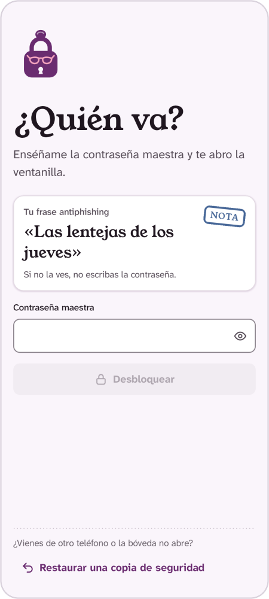
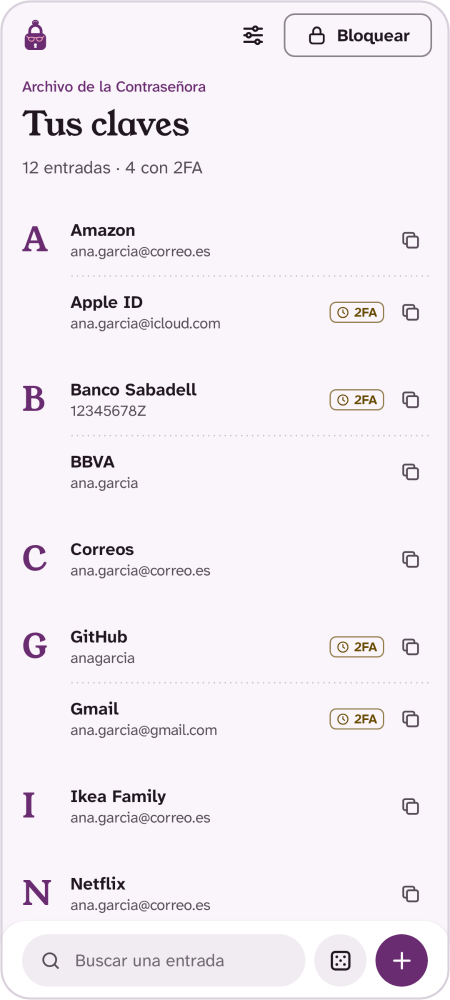
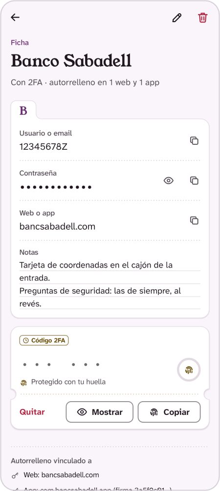
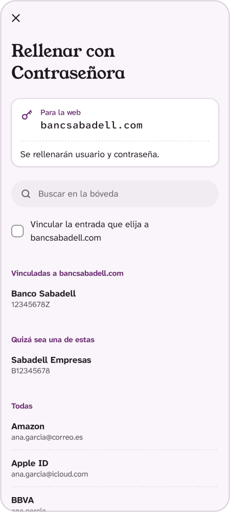

<p align="center">
  <picture>
    <source media="(prefers-color-scheme: dark)" srcset="docs/marca/logotipo-horizontal-sobre-oscuro.png">
    
  </picture>
</p>

<p align="center">
  <strong>Gestor de contraseñas y códigos 2FA para Android que no se conecta a nada.</strong><br>
  Todo se cifra y se queda en tu teléfono: sin Internet, sin nube y sin cuentas.
</p>

<p align="center">
  <a href="https://github.com/JLS97/react-clean-components/actions/workflows/ci.yml"></a>
  
  
  
  <a href="LICENSE"></a>
</p>

<p align="center">
  <picture>
    <source media="(prefers-color-scheme: dark)" srcset="docs/capturas/desbloqueo-oscuro.png">
    
  </picture>
  <picture>
    <source media="(prefers-color-scheme: dark)" srcset="docs/capturas/fichero-oscuro.png">
    
  </picture>
  <picture>
    <source media="(prefers-color-scheme: dark)" srcset="docs/capturas/ficha-oscuro.png">
    
  </picture>
  <picture>
    <source media="(prefers-color-scheme: dark)" srcset="docs/capturas/autorrelleno-oscuro.png">
    
  </picture>
</p>

<p align="center">
  <sub>Desbloqueo con frase antiphishing · Lista de claves · Ficha con código 2FA · Autorrelleno con la web verificada ·
  <a href="docs/capturas/contrasenora-pantallas.png">Más pantallas</a> · Capturas con datos de muestra</sub>
</p>

## Qué es

Contraseñora es un gestor de contraseñas nativo para Android, escrito en Kotlin con Jetpack
Compose. Guarda tus contraseñas y tus códigos de verificación en dos pasos en una bóveda cifrada
que no sale del teléfono, salvo en las copias cifradas que exportes tú. La app no tiene permiso de
Internet, así que Android no la deja conectarse: no hay servidores, cuentas, analíticas ni nube.

Tiene carácter: es una señora seria, desconfiada y muy ordenada que guarda tus claves y no las
suelta ni bajo tortura. Seguridad seria, tono con gracia. Si prefieres los mismos avisos sin
chistes, en **Ajustes → Apariencia** puedes elegir la voz «Sobria», y también el tema claro, el
oscuro o el del sistema.

**Para quién y en qué estado.** Para quien quiera sus contraseñas y códigos 2FA solo en su
teléfono Android, sin depender de ninguna empresa ni de la nube. Es un proyecto personal en
desarrollo (versión 0.2.0): no está en Google Play ni en F-Droid y no hay APK de release
publicado. Puedes probarla en unos minutos con el APK de prueba; para guardar tus contraseñas de
verdad, compílala y fírmala tú (ver [Pruébala](#pruébala)).

## Qué hace

- **Bóveda cifrada** con una contraseña maestra (con indicador de fortaleza), desbloqueo opcional
  con huella y bloqueo automático: por inactividad (o al salir de la app, si lo eliges) y siempre
  al apagar la pantalla.
- **Entradas** con nombre, usuario o email, contraseña, web o app y notas, con búsqueda.
- **Autorrelleno** en otras apps y en el navegador. Comprueba quién lo pide (la firma de la app o
  el dominio informado por un navegador reconocido) y ofrece guardar las credenciales nuevas.
- **Códigos 2FA (TOTP)**, como los de Google Authenticator pero sin nube: se añaden escaneando el
  QR o con la clave de texto, y en el día a día hace falta tu huella para ver o copiar cada código.
- **Generador de contraseñas** de 8 a 128 caracteres, con los tipos de carácter que elijas.
- **Copias de seguridad cifradas** (`.bvd`) que se comprueban al exportarlas y se pueden restaurar
  en otro teléfono; restaurar guarda la bóveda anterior para poder deshacerlo.
- **Frase antiphishing** que eliges tú y que aparece en la pantalla de desbloqueo, también cuando
  Contraseñora sale encima de otra app para rellenar: si no la ves, no escribas la contraseña
  maestra.
- **Portapapeles** marcado como sensible y con borrado automático (de 15 s a 2 min).

## Seguridad en un vistazo

| Qué | Cómo |
|---|---|
| **Cifrado** | Argon2id (64 MiB, 3 pasadas, 4 carriles) para la contraseña maestra y AES-256-GCM con todo autenticado, cabeceras incluidas. |
| **Hardware** | En el teléfono, la bóveda lleva una segunda capa con una clave de Android Keystore (StrongBox o TEE): una copia de ese archivo sacada del teléfono no sirve ni para probar contraseñas. Las copias `.bvd` no llevan esa capa, para poder restaurarlas en otro teléfono: solo las protege la contraseña maestra. Si el teléfono solo tiene clave de software, Ajustes lo avisa. |
| **2FA** | Clave propia que pide la huella en cada uso (solo sensores de clase 3, los que Android considera seguros), más un código de recuperación para cambiar de teléfono. |
| **Red y permisos** | Sin permiso `INTERNET`: el manifiesto lo elimina aunque una librería lo pida. Solo pide la huella, la cámara (para escanear el QR de un 2FA, cuando lo usas), ocultar ventanas superpuestas y ver las apps instaladas (para comprobar la firma de la app que pide autorrellenar; la lista no se guarda). |
| **Pantalla** | `FLAG_SECURE` (sin capturas ni vista previa en recientes). Oculta las ventanas que otras apps superpongan encima y no deja que otro gestor de contraseñas autorrellene sus campos. |
| **Fuerza bruta** | Freno creciente tras 5 fallos, medido con el reloj monótono del sistema: cambiar la hora no lo acorta. |
| **Revisión** | Revisión de seguridad del código de la versión 0.2.0 (octubre de 2026), hecha con agentes de IA; no es una auditoría externa independiente. [101 hallazgos y su estado de corrección](docs/AUDITORIA_SEGURIDAD.md). El rediseño visual es posterior. |

Lo que protege y lo que no (root, teclados o servicios de accesibilidad maliciosos, olvidar la
contraseña maestra) está en [SECURITY.md](SECURITY.md). El diseño criptográfico completo, el
autorrelleno y los códigos 2FA, con detalle, están en la [guía](docs/GUIA.md).

## Pruébala

**Con el APK de prueba.** GitHub compila uno con cada cambio:

1. Con tu sesión de GitHub iniciada (sin ella no deja descargarlo), abre las
   [ejecuciones de `master`](https://github.com/JLS97/react-clean-components/actions/workflows/ci.yml?query=branch%3Amaster),
   entra en la última con la marca verde y descarga **apk-debug** en el apartado **Artifacts**.
2. Llega un `apk-debug.zip`. Descomprímelo: dentro está `app-debug.apk`.
3. Ábrelo en el teléfono. La primera vez, Android pedirá permiso para que esa app (el navegador o
   el gestor de archivos) **instale apps desconocidas**: actívalo solo para esto. Si Play Protect
   avisa de que no reconoce al desarrollador, es lo normal fuera de Google Play. Desde el ordenador
   también puedes usar `adb install -r app-debug.apk` (ver [Compilar](#compilar)).

Necesitas Android 13 o superior y un bloqueo de pantalla (PIN, patrón o contraseña): sin él,
Contraseñora no deja crear la bóveda. Los códigos 2FA piden además una huella registrada.

Se instala como «Contraseñora Debug» (`io.github.jls97.boveda.debug`), una app aparte con sus
propios datos. Úsala solo para probar: su clave de firma está publicada en el repositorio
(`app/debug.keystore`) para que cada APK de prueba se instale encima del anterior, pero eso también
permite que cualquiera firme una «actualización» suya; además es depurable por USB
([más detalles](SECURITY.md#la-clave-de-firma-debug-está-publicada)). Si Android dice que el
paquete «entra en conflicto con un paquete existente», tienes una Contraseñora Debug antigua
firmada con otra clave: desinstálala (exporta antes una copia si guardaste algo) y vuelve a
instalar.

**Para el uso diario**, compila la versión release firmada con tu propia clave: así las
actualizaciones se instalan encima sin perder la bóveda. Los pasos están en
[docs/RELEASE.md](docs/RELEASE.md) y la instalación en el teléfono, en la
[guía](docs/GUIA.md#instalar-tu-propia-versión-en-el-teléfono).

## Compilar

Necesitas:

- **JDK 21**, el mismo que usa la CI. Android Studio trae uno; usa una versión reciente, porque las
  antiguas no abren proyectos con el Android Gradle Plugin 9.4.
- **Android SDK** con la plataforma `android-37.0` y las build-tools `36.0.0`. Android Studio las
  ofrece al abrir el proyecto. Sin Android Studio, instálalas con `sdkmanager` (está en
  `cmdline-tools/latest/bin` de las herramientas de línea de comandos), acepta las licencias cuando
  lo pida y define `ANDROID_HOME` (o `sdk.dir` en `local.properties`):

  ```sh
  sdkmanager "platforms;android-37.0" "build-tools;36.0.0" "platform-tools"
  ```

- Para instalar desde el ordenador con `adb`: en el teléfono, activa las **opciones de
  desarrollador** y la **depuración USB**, conecta el cable y acepta el aviso
  ([pasos](docs/GUIA.md#instalar-tu-propia-versión-en-el-teléfono)).

```sh
git clone https://github.com/JLS97/react-clean-components.git contrasenora
cd contrasenora

./gradlew assembleDebug                                    # APK en app/build/outputs/apk/debug/
adb install -r app/build/outputs/apk/debug/app-debug.apk   # instala «Contraseñora Debug»

./gradlew testDebugUnitTest lintDebug                      # tests y lint, como la CI
./gradlew assembleRelease                                  # release (firma: docs/RELEASE.md)
```

En Windows, usa `gradlew.bat` en lugar de `./gradlew`.

- La primera compilación descarga Gradle, comprobado con la suma `distributionSha256Sum` de
  `gradle/wrapper/gradle-wrapper.properties`, y las dependencias, cada una comprobada contra
  `gradle/verification-metadata.xml`: la build falla si algo no coincide. Si cambias una
  dependencia, regenera ese archivo con el comando de [docs/RELEASE.md](docs/RELEASE.md).
- La CI compila en Linux. Para macOS y Windows, el archivo de verificación incluye también sus
  variantes de `aapt2`; si en tu sistema la verificación pide alguna suma más, abre un *issue*.
- Sin las variables de firma (`BOVEDA_KEYSTORE` y compañía), `assembleRelease` genera un APK sin
  firmar, que Android no instala.
- El APK debug se firma con `app/debug.keystore`, publicada a propósito (ver
  [SECURITY.md](SECURITY.md#la-clave-de-firma-debug-está-publicada)). La clave de release nunca va
  al repositorio.

## Documentación

- [Guía de uso y seguridad](docs/GUIA.md): autorrelleno, códigos 2FA, copias de seguridad, diseño
  criptográfico y límites.
- [SECURITY.md](SECURITY.md): modelo de amenaza y cómo informar de un fallo de seguridad.
- [Revisión de seguridad](docs/AUDITORIA_SEGURIDAD.md) de octubre de 2026 (hecha con agentes de IA
  sobre la versión anterior al rediseño), con su
  [anexo de hallazgos](docs/AUDITORIA_SEGURIDAD_ANEXO_HALLAZGOS.md).
- [Publicar una versión](docs/RELEASE.md): clave de firma, verificación del APK y dependencias.
- [Descripción funcional](docs/DESCRIPCION_FUNCIONAL.md): pantallas y flujos tal como eran antes
  del rediseño visual (el funcionamiento es el mismo; los textos, el aspecto y los ajustes de
  Apariencia han cambiado).

## Estructura del proyecto

```text
app/src/main/java/io/github/jls97/boveda/
├── core/        # Kotlin puro, con tests: crypto (Argon2id, AES-GCM), formato de la bóveda,
│                #   códigos 2FA (TOTP, enlaces otpauth, código de recuperación), generador y
│                #   lógica del autorrelleno (detección de campos, emparejamiento)
├── autofill/    # servicio de autorrelleno, sugerencia del teclado y pantallas de elegir y guardar
├── security/    # Android Keystore, huella, portapapeles sensible, freno de intentos
├── data/        # archivos en almacenamiento sin copia de seguridad, escritura atómica
├── session/     # estado bloqueado/desbloqueado, bloqueo automático
└── ui/          # pantallas en Compose
    ├── theme/       # ContrasenoraTheme: colores, tipografía, formas, movimiento y personalidad
    └── components/  # la base de la marca: papel, avisos con sello, botones, campos, isotipo…
```

- Kotlin 2.4 con el Android Gradle Plugin 9.4, Compose con Material 3 y Gradle 9.7.
- `minSdk` 33 (Android 13); `compileSdk` y `targetSdk` 37 (Android 17).
- Dependencias mínimas: AndroidX (Compose, Activity, Lifecycle, Autofill, CameraX), Bouncy Castle
  solo para Argon2id y ZXing solo para leer códigos QR.
- La app se llamaba «Bóveda». El paquete (`io.github.jls97.boveda`), la extensión `.bvd`, la
  cabecera de los archivos y los alias del Keystore conservan el nombre antiguo a propósito, para
  que las bóvedas y copias existentes sigan abriéndose y la app se actualice encima de la anterior.

## Diseño

Fichas de papel sobre fondo claro (o ciruela oscuro), títulos en Young Serif y Atkinson
Hyperlegible para el texto, las contraseñas y los códigos. Los avisos llevan un sello de goma
(Conforme, Ojo, Urgente, Nota). El color dinámico de Material You está desactivado a propósito.

## Contribuir

Se agradecen *issues* y *pull requests*. Antes de abrir una PR, pasa `./gradlew testDebugUnitTest
lintDebug`: la CI lo comprueba en cada push, junto con la firma del APK debug. Los fallos de
seguridad no se publican en un *issue* con detalles explotables: sigue [SECURITY.md](SECURITY.md).

Si tocas la interfaz:

- Usa `ContrasenoraTheme.colors` y `ContrasenoraTheme.type` (nunca la paleta suelta ni
  `MaterialTheme` directo) y los iconos propios de `res/drawable/ic_*`.
- Los textos con humor pasan por `voz("…", "…")` en Compose o por `elige("…", "…")` de
  `Personalidad` en los ViewModels (primero la versión Contraseñora y después la Sobria). Nunca van
  en avisos importantes, botones ni confirmaciones destructivas.
- El movimiento usa los tokens de `Motion` y respeta «Quitar animaciones».

Ideas pendientes, todas sin Internet: un teclado propio para las apps donde el autorrelleno no
funcione, una auditoría local de contraseñas repetidas o débiles, importar la exportación de
Google Authenticator, un generador de frases, y favoritos y categorías.

## Licencia

[GPL-3.0](LICENSE).
